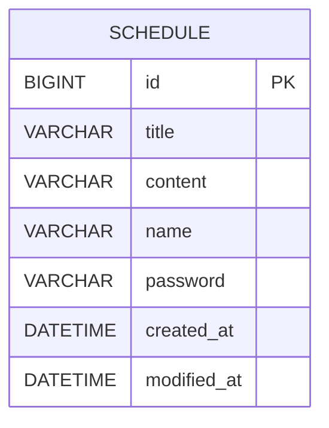

# schedule-app-develop




### 회원가입

request

```json
{
"email" : "음료수중독@gmail.com",
"password" : "123456789",
"nickName" : "음료수중독"
}
```

response

```json
{
"email" : "음료수중독@gmail.com",
"nickName" : "음료수중독",
"message" : "회원가입 되었습니다."
}
```

### 로그인

request

```jsx
{
"email" : "음료수중독@gmail.com",
"password" : "123456789"
}
```

```jsx
{
"message" : "로그인 되었습니다."
}
```

### 유저 전체 조회

### 유저 단건 조회

### 유저 정보 수정

```jsx
{
"email" : "음료수중독@gmail.com",
"nickName" : "유료버전챗지피티"
}
```

```jsx
{
"message" : "정보가 수정되었습니다"
"id" : 1
}
```

### 유저 삭제

```jsx
{
"message" : "정보가 삭제되었습니다"
}
```

### 일정 생성

```jsx
{
"title" : "까치 밥 주는 날",
"content" : "할머니댁 파란색 지붕 창고에 왼쪽 선반에 광주리 안에 까치밥",
"email" : "음료수중독@gmail.com",
"password" : "123456789"
}
```

```json
{
"title" : "까치 밥 주는 날",
"content" : "할머니댁 파란색 지붕 창고에 왼쪽 선반에 광주리 안에 까치밥",
"nickName" : "유료버전챗지피티",
"createdAt" : "2026-02-04T07:33:07Z"
}
```

### 일정 전체 조회

### 일정 단건 조회

### 일정 수정

```json
{
"title" : "까치 밥 주는 날",
"content" : "이미 줌",
"email" : "음료수중독@gmail.com",
"password" : "123456789"
}
```

```json
{
"title" : "까치 밥 주는 날",
"content" : "이미 줌",
"nickName" : "유료버전챗지피티",
"createdAt" : "2026-02-04T07:33:07Z",
"modifiedAt" : "2026-02-04T07:33:07Z"
}
```

### 유저 삭제

```json
{
"title" : "까치 밥 주는 날",
"content" : "이미 줌",
"email" : "음료수중독@gmail.com",
"password" : "123456789"
}
```

```json
{
"message" : "정보가 삭제되었습니다"
}
```
